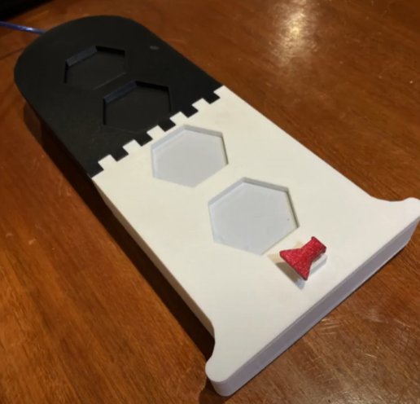
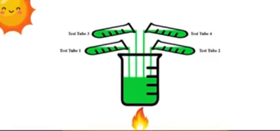
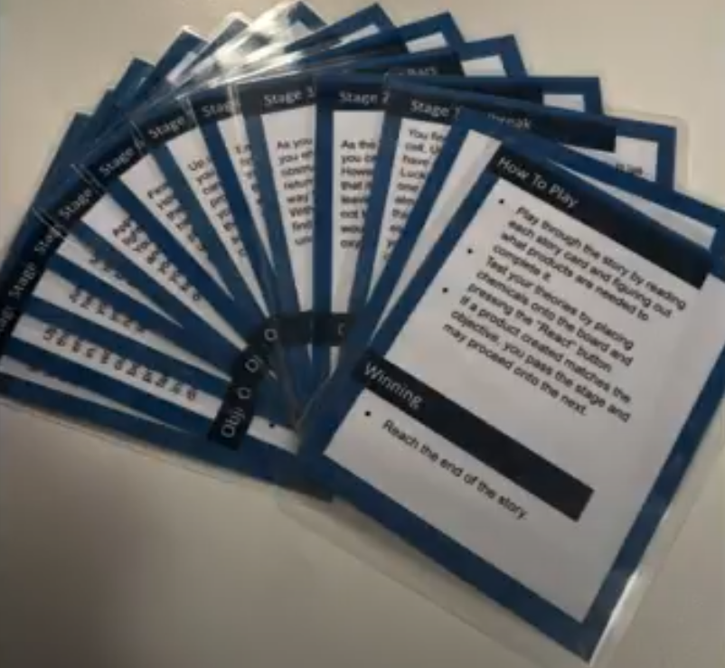
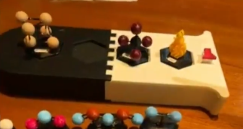

# ChemQuest
ChemQuest is a story board game that helps students learn chemistry by using chemical reactions to complete the narrative. Follow a story and complete objectives to progress. Uses rfid tagging and arduino to read placed chemicals and compute reactions.

Plug in the test tube game board to a PC and start up the web page.

 

Place different chemicals on the board to try and create a reaction that will solve the current situation.
 

# Usage
1. Plug in the board to your PC
2. run `node chemistry-boardgame/server.js`
